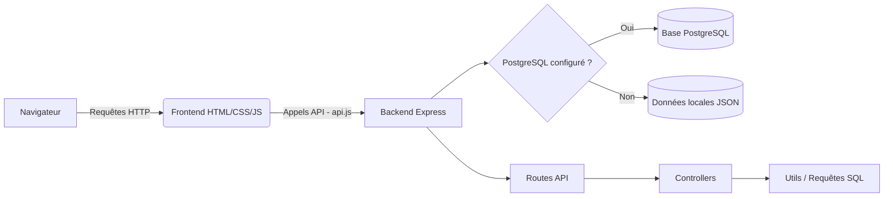

<div align="center">


<br/>


<br/><br/>

[](https://nodejs.org/)
[](https://expressjs.com/)
[](https://www.postgresql.org/)
[](#)
[](#)
[](#)

[](#)
[](#)
[](#)
[](#)

</div>

<br/>

**PharmaGarde** est une application web qui permet de trouver facilement la **pharmacie de garde la plus proche** à Pointe-Noire (Congo-Brazzaville). Elle affiche le planning de la semaine, permet de filtrer par quartier ou arrondissement, de consulter les médicaments disponibles, et de signaler un problème.

<br/>

## Sommaire

- [Sommaire](#sommaire)
- [Fonctionnalités](#fonctionnalités)
- [Stack technique](#stack-technique)
- [Architecture](#architecture)
- [Structure du projet](#structure-du-projet)
- [Installation](#installation)
- [Configuration de la base de données](#configuration-de-la-base-de-données)
- [Lancer le projet](#lancer-le-projet)
- [Scripts disponibles](#scripts-disponibles)
- [L'équipe](#léquipe)

<br/>

## Fonctionnalités

<table>
<tr>
<td width="50%">

**Recherche & consultation**
- Pharmacies de garde de la semaine
- Filtres : quartier, arrondissement, statut, garde 24h/24
- Carte interactive des pharmacies
- Consultation des médicaments et disponibilité

</td>
<td width="50%">

**Support & fiabilité**
- Foire aux questions (FAQ)
- Formulaire de signalement (info erronée, pharmacie manquante...)
- Numéros d'urgence toujours accessibles
- Repli automatique sur données locales

</td>
</tr>
</table>

<br/>

## Stack technique

<div align="center">

| Côté | Technologies |
|:---:|:---|
| **Backend** |    |
| **Frontend** |    *(sans framework)* |

</div>

<br/>

## Architecture



<br/>

## Structure du projet

```
.
├── package.json
├── .env.example
├── backend/
│   ├── index.js              # Point d'entrée du serveur
│   ├── controllers/          # Logique métier (pharmacies, arrondissements, signalements...)
│   ├── routes/               # Routes de l'API
│   ├── utils/                # Connexion base de données, requêtes SQL, gestion des erreurs
│   └── data/                 # Données de secours (mode sans base de données)
└── frontend/
    ├── index.html
    ├── pharmacies.html
    ├── medicaments.html
    ├── urgence.html
    ├── css/
    └── js/
        ├── api.js            # Appels vers l'API
        ├── components.js     # Composants réutilisables
        ├── utils.js           # Icônes et fonctions utilitaires
        └── pages/             # Scripts spécifiques à chaque page
```

<br/>

## Installation

**1. Cloner le projet**
```bash
git clone <url-du-repo>
cd pharmacie-de-garde
```

**2. Installer les dépendances**
```bash
npm install
```

**3. Créer un fichier `.env` à partir de l'exemple fourni**
```bash
cp .env.example .env
```

**4. Renseigner les variables dans `.env`** *(optionnel — voir ci-dessous)*

<br/>

## Configuration de la base de données

L'application peut fonctionner de deux façons :

| Mode | Description |
|---|---|
| **Avec PostgreSQL** | Renseigner `DATABASE_URL` (ou `PG_USER`, `PG_HOST`, `PG_DATABASE`, `PG_PASSWORD`, `PG_PORT`) dans le fichier `.env` |
| **Sans base de données** | Si aucune configuration PostgreSQL n'est fournie, l'application utilise automatiquement un jeu de données local (`backend/data/pharmaGarde.json`) |

Variables disponibles dans `.env.example` :

```env
PORT=3000
DATABASE_URL=
PG_USER=postgres
PG_HOST=localhost
PG_DATABASE=pharmagarde
PG_PASSWORD=
PG_PORT=5432
```

<br/>

## Lancer le projet

```bash
npm start
```

> Le serveur démarre sur `http://localhost:3000` (ou le port défini dans `.env`).

<br/>

## Scripts disponibles

| Commande | Description |
|:---|:---|
| `npm start` | Démarre le serveur |
| `npm run dev` | Démarre le serveur (mode développement) |
| `npm run seed` | Remplit la base de données avec des données de départ |
| `npm run lint` | Vérifie la syntaxe des fichiers backend |

<br/>

## L'équipe

<div align="center">

| Rôle | Nom |
|:---:|:---:|
| **Chef de Projet** | Cedric NGOUBI |
| **Développeur** | Alphadi MONDZALI |
| **Développeur** | Steven KILONDA |

</div>

<br/>

<div align="center">

Projet **PharmaGarde** — Pointe-Noire
<br/>
*BY AKIENI ACADEMY Intern*


</div>